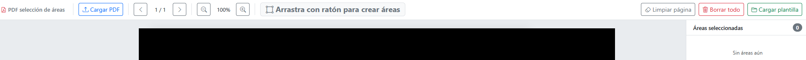

# pdf_to_csv
App web que permite convierte tablas complejas de un pdf a CSV mediante el navegador.

# Uso
- Abrir index.html en el navegador

- Cargar PDF mediante botón

- Aparecerán indicaciones para crear áreas. Además de los botones de:

-> Limpiar áreas de la página actual

-> Borrar todas las áreas marcadas en el pdf

-> importar una plantilla de áreas existente

## Creación de áreas
- Con el PDF visible, click con el ratón y arrastrar para marcar los datos a extraer.
- Dejar de pulsar el ratón para crear el área y darle un nombre.
- Una vez creada al menos 1 área (o importada una plantilla) aparecerán más opciones.
- Se visualizarán las áreas y sus coordenadas. Se puede modificar o eliminar cada área.

## Extracción de datos

NOTA: Marque la casilla "Repetir áreas en todas las páginas" si todas las páginas tienen el mismo formato. Actualmente solo funciona esta opción para las páginas distintas a la 1ª.

- Pulsar el botón de "Extraer texto". SOLO VISIBLE SI EXISTEN ÁREAS CREADAS.
- Si no hay errores, se mostrará una ventana con una tabla conteniendo los datos a exportar.
- Pulsar el botón de "Exportar CSV" para obtener el archivo csv.

NOTA: Para facilitar el manejo de los datos, la tabla se exporta en formato horizontal.

# Ideas de mejora
- Añadir opción para unir pdf's en un nuevo archivo