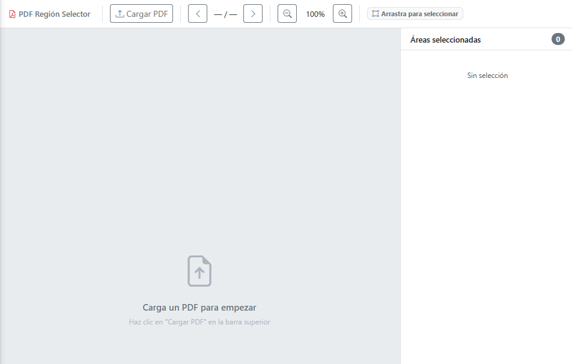
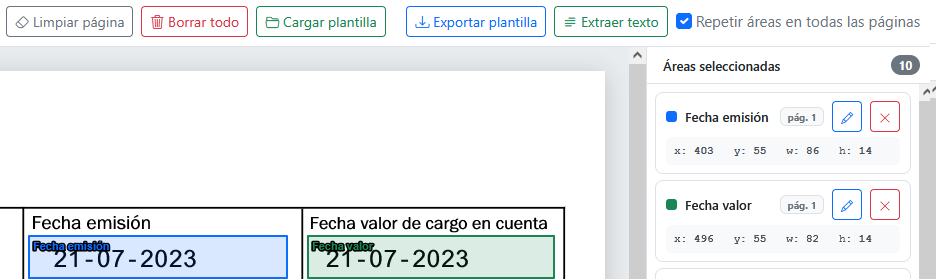
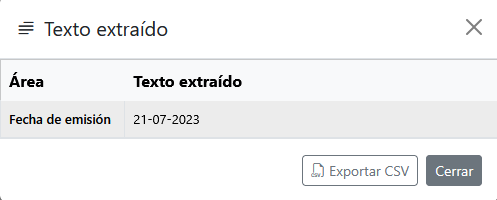

# pdf_to_csv
App web que permite convierte tablas complejas de un pdf a CSV/XLSX mediante el navegador.

# Uso
1- Abrir index.html en el navegador

2- Cargar PDF mediante botón

## Creación de áreas
--Los siguientes pasos pueden omiterse si ya se han realizado con anterioridad y se tiene un json con las áreas--

3- Con el PDF visible, click izquierdo con el ratón y arrastrar para marcar los datos a extraer.

4- Dejar de pulsar el ratón para guardar el área y darle un nombre.

5- Repetir en el resto de áreas los puntos 3 al 5

6- Exportar áreas como json

## Extracción de datos
7- Pulsar el botón de "Extraer texto". Se solicitará un JSON del usuario para extraer el contenido.

8- Si el JSON es correcto, se mostrará una ventana con una tabla conteniendo los datos a exportar.

9- Pulsar el botón de "Exportar CSV" para obtener el archivo csv.

NOTA: Para facilitar el manejo de los datos, la tabla se exporta en formato horizontal.

